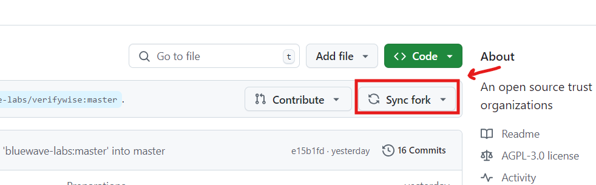

# Basic Git Instructions

A basic overview and guideline for working with git/github on your projects

---

#### Fork the repository

In order to fork a repository and contribute to the project, you need to take the following steps:

1. Open the GitHub page of the project you want to work on
2. Click on the **Fork** button on the top right of the screen, and then select **Create a new fork** as below:

#### Clone your forked repository

You can clone your forked repository in two ways:

1. ##### using your IDE
   You can clone your forked repository using your favorite IDE easily. We're using **VSCode** in our example.

2. ##### using your command line

You can also clone your repository using the following command:

`git clone <url_for_the_repository>`

example: `git clone https://github.com/bluewave-labs/verifywise.git`

---

#### Syncing and fetching latest updates

Before creating a new branch every time, or after your pull request is merged and your about to move to the next step (e.g. task or issue), you must fetch the latest changes from the original repository and make your forked repository up-to-date. So, here's how you can do it.

1. After you've got your **pull request** **_merged_** or before **creating a new branch**, open the github page of your forked repository and click on the **Sync fork** button to make your repo up-to-date, as below:

2. After syncing, you'll need to perform the following command on your system to fetch the changes on your local, too.

`git fetch`

---
